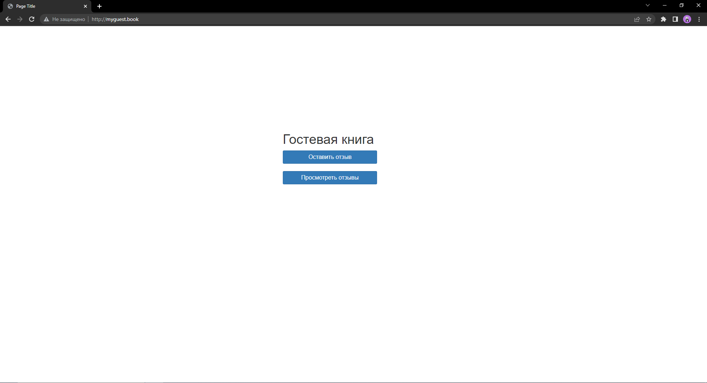
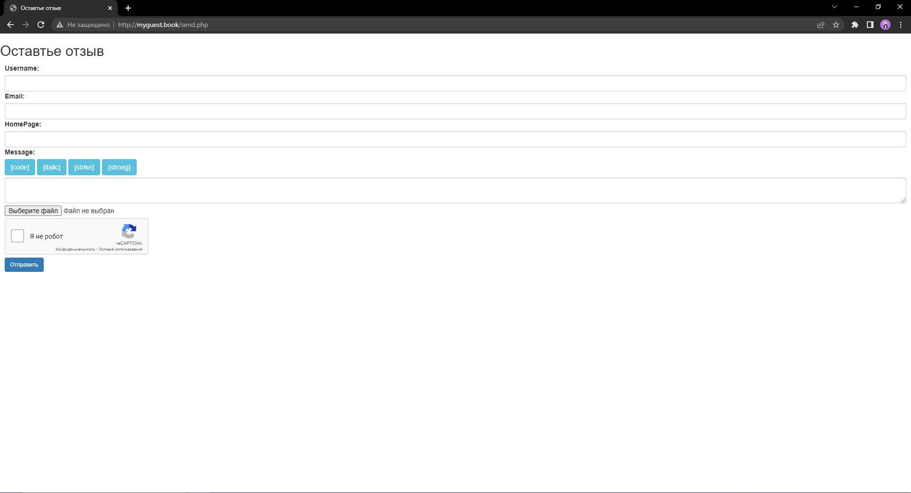
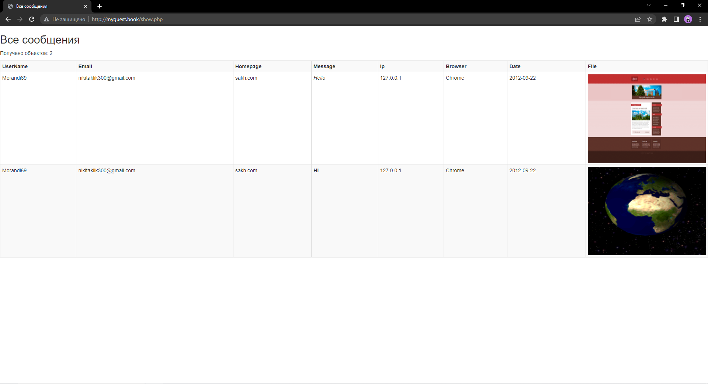

<h2 style="text-align: center; margin-top: 100px;font-size:40px">Guest Book</h2>
<h2 style="text-align: center; margin-top:10px">Разработка серверных скриптов</h2>
<h3 style="text-align: right; margin-top:400px">Выполнил студент 3 курса   Чагочкин Никита</h3>
<h3 style="text-align: center; margin-top:40px">Южно-Сахалинск  2022 г. </h3>

- - -

## Начальная страница
    <!DOCTYPE html>
    <html>

    <head>
        <meta charset='utf-8'>
        <meta http-equiv='X-UA-Compatible' content='IE=edge'>
        <title>Page Title</title>
        <meta name='viewport' content='width=device-width, initial-scale=1'>
        <link href="https://maxcdn.bootstrapcdn.com/bootstrap/3.3.7/css/bootstrap.min.css" rel="stylesheet" />
        
    </head>

    <body>
        <h1 style="margin-top:15%; margin-left: 40%; margin-right: auto;  width: 20em">Гостевая книга</h1>
        <button style="margin-left: 40%; font-size: medium;   width: 16em" type="submit" class="btn btn-sm btn-primary" onClick="location.href='http://myguest.book/send.php'">Оставить отзыв</button>
         
         
        <button style="margin-left: 40%; font-size: medium;   width: 16em" type="submit" class="btn btn-sm btn-primary" onClick="location.href='http://myguest.book/show.php'">Просмотреть отзывы</button> 
    </body>

    </html>

## Страница с Формой
    <!DOCTYPE html>
    <html>
    <head>
        <meta charset="utf-8" />
        <meta name="viewport" content="width=device-width" />
        <title>Оставтье отзыв</title>
        <link href="https://maxcdn.bootstrapcdn.com/bootstrap/3.3.7/css/bootstrap.min.css" rel="stylesheet" />
        
    </head>
    <body>
        <h2>Оставтье отзыв</h2>
        <form class="my-form" action="sender.php" method="post" enctype="multipart/form-data" style="margin-left:10px; margin-right:10px">    
            <label for="name">Username:</label>
            <input class="form-control" name="username" />
            
            <label for="email">Email:</label>
            <input id="emailinput" class="form-control" name="email" />
        
            <label for="homepage">HomePage:</label>
            <input class="form-control" name="homepage" />
        
            <label for="message">Message:</label> 

            <button type="button" onclick="code()" class="btn btn-info">[code]</button>
            <button type="button" onclick="italic()" class="btn btn-info">[italic]</button>
            <button type="button" onclick="strike()" class="btn btn-info">[strike]</button>
            <button type="button" onclick="strong()" class="btn btn-info">[strong]</button>
            

            <textarea id="textarea" style="margin-top:5px" class="form-control" name="message"></textarea>
            
            <input style="margin-top:5px;"  type="file"  name="file">

            

            <button style="margin-top:5px; " class="btn btn-sm btn-primary" type="submit" name="submit" >Отправить</button> 
        </form>
        
        

        </body>
    </html>
## Обработка форма на сервере
    <?php
    $conn = new mysqli("localhost", "root", "root","messages");
    if($conn->connect_error){
        die("Ошибка: " . $conn->connect_error);
    }
    $UserName = strip_tags($_POST["username"]);
    $Email = strip_tags($_POST["email"]);
    $Homepage = strip_tags($_POST["homepage"]);
    $Text = $_POST["message"];

    //ip
    $ip = $_SERVER['REMOTE_ADDR'];
    function getIp() {
    $keys = [
        'HTTP_CLIENT_IP',
        'HTTP_X_FORWARDED_FOR',
        'REMOTE_ADDR'
    ];
    foreach ($keys as $key) {
        if (!empty($_SERVER[$key])) {
        $ip = trim(end(explode(',', $_SERVER[$key])));
        if (filter_var($ip, FILTER_VALIDATE_IP)) {
            return $ip;
        }
        }
    }
    }

    $ip = getIp();
    //Browser
    $user_agent = $_SERVER["HTTP_USER_AGENT"];
    if (strpos($user_agent, "Firefox") !== false) $browser = "Firefox";
    elseif (strpos($user_agent, "Opera") !== false) $browser = "Opera";
    elseif (strpos($user_agent, "Chrome") !== false) $browser = "Chrome";
    elseif (strpos($user_agent, "MSIE") !== false) $browser = "Internet Explorer";
    elseif (strpos($user_agent, "Safari") !== false) $browser = "Safari";
    else $browser = "Неизвестный";
    //Дата
    $date = date("m.d.y");
    //Файл
    if($_FILES["file"]["type"]=='image/png' || $_FILES["file"]["type"]=='image/jpeg' || $_FILES["file"]["type"]=='image/gif'){
    require_once  'thumbs.php';

    $image = new Thumbs($_FILES["file"]['tmp_name']);
    $image->reduce(320, 240);
    $image->save();
    
    $filename=time().$_FILES["file"]['name'];
    move_uploaded_file($_FILES["file"]['tmp_name'],'data/'.$filename);
    }
    else if($_FILES["file"]["type"]=='text/plain' && $_FILES["file"]["size"]<105000){
    $filename=time().$_FILES["file"]['name'];
    move_uploaded_file($_FILES["file"]['tmp_name'],'data/'.$filename);
    }
    echo($Text);
    //Отправляем в таблицу
    $result = $conn->query("INSERT INTO `allmess` (`username`, `email`, `homepage`, `text`, `ip`, `browser`, `date`, `filename`) VALUES ('$UserName', '$Email', '$Homepage', '$Text','$ip','$browser','$date','$filename');");
    ?>
    <link href="https://maxcdn.bootstrapcdn.com/bootstrap/3.3.7/css/bootstrap.min.css" rel="stylesheet" />
    <h2 style="margin-top:15%; margin-left: 40%; margin-right: auto;  width: 20em">Сообщение отправлено</h2>
    <button style="margin-left: 40%; font-size: medium;   width: 21em" type="submit" class="btn btn-sm btn-primary" onClick="location.href='http://myguest.book'">На главную</button>

## Просмотр Информации

    <!DOCTYPE html>
    <html>
    <head>
        <meta charset="utf-8" />
        <meta name="viewport" content="width=device-width" />
        <title>Все сообщения</title>
        <link href="https://maxcdn.bootstrapcdn.com/bootstrap/3.3.7/css/bootstrap.min.css" rel="stylesheet" />
    </head>
    <body>
        <h2>Все сообщения</h2>
        <?php
        $conn = new mysqli("localhost", "root", "root", "messages");
        if($conn->connect_error){
        die("Ошибка: " . $conn->connect_error);
        }
        $sql = "SELECT * FROM allmess";
        if($result = $conn->query($sql)){
        $rowsCount = $result->num_rows; // количество полученных строк
        echo "
Получено объектов: $rowsCount
";
        echo "<table class='table table-condensed table-striped table-bordered'>
        <tr><th>UserName</th><th>Email</th><th>Homepage</th><th>Message</th><th>Ip</th><th>Browser</th><th>Date</th><th>File</th></tr>";
        foreach($result as $row){
            $filename=$row["filename"];
            $pattern_name = '/\*\.txt/';
            echo "<tr>";
                echo "<td>" . $row["username"] . "</td>";
                echo "<td>" . $row["email"] . "</td>";
                echo "<td>" . $row["homepage"] . "</td>";
                echo "<td>" . $row["text"] . "</td>";
                echo "<td>" . $row["ip"] . "</td>";
                echo "<td>" . $row["browser"] . "</td>";
                echo "<td>" . $row["date"] . "</td>";
                if($filename!=null && end(explode(".", $filename))=="txt"){
                    echo "<td >" . $filename . "</td>";
                }
                else if($filename!=null ){
                echo "<td width=\"250\">" . "". "</td>";
                }
                
            echo "</tr>";
        }
        echo "</table>";
        $result->free();
        } else{
        echo "Ошибка: " . $conn->error;
        }
        $conn->close();
        ?>
        </body>

     